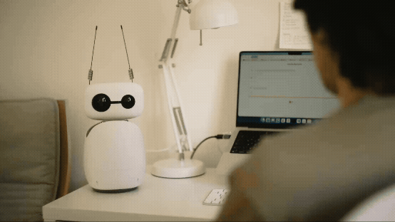

<div align="center">
  <h1>Reachy Mini Apps</h1>
  <a href="https://huggingface.co/spaces/pollen-robotics/Reachy_Mini"></a>
</div>

<p align="center">
    <strong>Explore the world of expressive robotics with this collection of mini-applications for the Reachy Mini. Get inspired and start building your own interactive experiences!</strong>
</p>

<p align="center">
    <a href="https://www.python.org/downloads/"></a>
    <a href="https://codecov.io/gh/jjmartres/reachy-mini-apps"></a>
    <a href="https://docs.astral.sh/uv/"></a>
    </br>
    <a href="https://github.com/jjmartres/smartplaylist/issues"></a>
    <a href="https://github.com/jjmartres/smartplaylist/pulls"></a>
</p>

---

## What is Reachy Mini?

[Reachy Mini](https://huggingface.co/spaces/pollen-robotics/Reachy_Mini) is an open-source, expressive robot created by Pollen Robotics. It's designed for developers, researchers, and AI enthusiasts to explore robotics and human-robot interaction.

## About This Repository

This repository provides a collection of mini-applications that showcase the capabilities of the Reachy Mini robot. These demos are designed to be simple, easy to run, and fun to watch.

## Prerequisites

Before you begin, ensure you have the following installed:

-   **[Git LFS](https://git-lfs.com/)**: Required for handling large files in the repository.

## Getting Started

To set up the development environment, follow these steps:

1.  **Set up the environment**:
    ```bash
    make setup
    ```
    This command will create a virtual environment, install all the required dependencies, and set up Git LFS.

2.  **Install in editable mode**:
    ```bash
    make install-dev
    ```
    This command will install the project in editable mode, which is useful for development.

## Available Demos

To run the demos, use the `uv run <demo-name>` command. You can add `-- --help` to any command to see its specific options.

---

### Minimal Demo

A simple demo that makes the robot's head and antennas oscillate. This is a great way to check if your robot is properly connected and responding to commands.

**Usage:**
```bash
uv run minimal-demo
```

---

### Motion Sequence

A more complex demo that showcases a sequence of different motions, including yaw, pitch, roll, and antenna movements.

**Usage:**
```bash
uv run motion-sequence
```

---

### Move Head

A simple demo that makes the robot's head draw a circle.

**Usage:**
```bash
uv run move-head
```

---

### All Recorded Moves

Plays all available moves from a dataset in a continuous loop.

**Usage:**
```bash
uv run recorded-moves [FLAGS]
```

**Flags:**
*   `--library {dance,emotions}`: Choose a built-in Hugging Face library (default: `dance`).
*   `--dataset PATH`: Specify a path to a local or Hugging Face dataset to override the library choice.

---

### Play a Set of Moves

Plays a specific, ordered set of moves from a local dataset once and then exits.

**Usage:**
```bash
uv run play-move-set --moves <MOVE_NAME_1> <MOVE_NAME_2> ... [FLAGS]
```

**Example:**
```bash
uv run play-move-set --moves simple_nod yeah_nod --library dance
```

**Flags:**
*   `--moves [NAME ...]`: (Required) A space-separated list of move names to play in sequence.
*   `--library {dance,emotions}`: Choose a built-in local library (default: `dance`).
*   `--dataset PATH`: Specify a path to a custom local or Hugging Face dataset.

## Development

This project uses `black` for code formatting, `ruff` for linting, and `pytest` for testing.

-   **Check formatting**: `black --check .`
-   **Apply formatting**: `black .`
-   **Run linter**: `ruff check .`
-   **Run all tests**: `pytest`

For more detailed information on the development workflow and code style guidelines, please refer to the `AGENTS.md` file.

## Contributing

Contributions are welcome! If you have an idea for a new demo or want to improve an existing one, please open an issue or submit a pull request. For more detailed information on how to contribute, please refer to the `CONTRIBUTING.md` file.

## License

This project is licensed under the MIT License. See the `LICENSE` file for more details.
